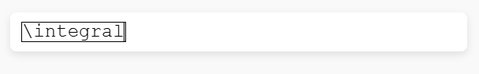
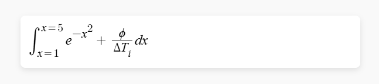

# LaTeX Equation Helper

A robust, "Word-like" desktop equation editor that allows you to visually edit mathematical formulas and automatically copies the resulting LaTeX code to your clipboard.


## Features

-   **Visual Editing**: Uses [MathQuill](http://mathquill.com/) to provide a WYSIWYG (What You See Is What You Get) interface. You see formattted math (fractions, roots, exponents) while you type, not raw code.
-   **Global Hotkey**: Press **`Ctrl + Alt + E`** anywhere in Windows to summon the editor instantly at your cursor position.
-   **Smart Positioning**: The window attempts to appear right next to your text cursor (caret). If no text field is active, it appears at your mouse cursor.
-   **Immediate Output**: Pressing **Enter** in the editor validates the equation and copies the LaTeX string to your clipboard, ready to paste.
-   **Standardized**: Produces clean, compatible LaTeX code.
-   **Portable**: Distributed as a single, standalone executable file. No Python installation required.

## Installation (Downloading the App)

The recommended way to get the latest version is to download it from the **Releases** page.

1.  **Go to Releases**: Click on **[Releases](../../releases)** on the right-hand sidebar of the repository page.
2.  **Select Latest Version**: Click on the top release (e.g., `v1.0.0`).
3.  **Download**: In the **Assets** section, click on `LaTeXHelper.exe` to download the tool.

*Note: No installation is needed. Just run the `.exe` file.*

## How to Run

1.  Navigate to the folder where you extracted the app (or the `dist` folder if building locally).

2.  Double-click **`LaTeXHelper.exe`**.
3.  A small "Control Window" will appear, indicating the app is running.
    *   *Note*: The app enforces a "Single Instance" rule. If you try to run it twice, it will warn you.
4.  Click into any text field (Word, Browser, Notepad, etc.).
5.  Press **`Ctrl + Alt + E`**.
6.  Type your equation.
7.  Press **Enter** to finish and copy to clipboard.
8.  To quit, simply close the "Control Window".

## Visual Demo
How to use the tool:

1.  **Activate**: Press `Ctrl + Alt + E`.
2.  **Write**: Type your equation naturally. Commands like `\integral` or `\sum` render instantly.
    
    

3.  **Submit**: Press **Enter**. The result is converted to LaTeX and ready to paste.
    
    

    *Example Output:*
    ```latex
    \int_{x=1}^{x=5}e^{-x^2}+\frac{\phi}{\Delta T_i}dx
    ```

## How it Works (Technical Overview)

The application is built using **Python 3.14** and **PySide6 (Qt for Python)**. It bridges the gap between a desktop application and a web-based math editor.

### Core Components

*   **`src/main.py`**: The entry point.
    *   **Single Instance Check**: Uses `QSharedMemory` to ensure only one copy of the app runs at a time.
    *   **High DPI Support**: specific Qt attributes are set to ensure the interface looks crisp on 4K monitors and laptops with scaling (125%, 150%).
    *   **Hotkey Listener**: Uses the `keyboard` library to listen for `Ctrl+Alt+E` globally.

*   **`src/gui.py`**: The heart of the user interface.
    *   **`OverlayWindow`**: A **frameless, transparent** window. It hosts a `QWebEngineView` (a Chromium-based browser widget) to display the HTML editor. It handles the logic for appearing/disappearing and "following" the user's cursor.
    *   **`ControlWindow`**: A standard window that provides user feedback (Run status) and a clean exit point.
    *   **`Backend`**: A `QObject` that sets up a `QWebChannel`. This allows Python to talk to JavaScript and vice-versa (e.g., JS tells Python "User pressed Enter with this equation").

*   **`src/editor.html` & `src/lib/`**: The web frontend.
    *   Contains the **MathQuill** library (CSS/JS).
    *   Provides the input field that interprets keystrokes (like typing `/` for fraction, `sqrt` for root) and renders them visually.

*   **`src/utils.py`**: Windows integration.
    *   **Caret Detection**: Uses the Windows C API (`user32.dll`) via `ctypes` to calculate the exact `x,y` coordinates of the blinking text cursor. This allows the overlay to spawn precisely where you are typing.
    *   **Clipboard**: Handles copying the final string to the system clipboard.

### Build System

The project is packaged using **PyInstaller**.
*   **Command**: `pyinstaller --onefile --windowed ...`
*   **Result**: A monolithic `.exe` file that bundles the Python interpreter, Qt libraries, and all project assets (HTML/CSS/Fonts) into a temporary filesystem (`_MEIPASS`), allowing it to run on any Windows machine.

## Maintainer Guide: Creating a Release

To publish a new version to the **Releases** section:

1.  **Commit your changes** as usual.
2.  **Tag the commit** with a version number (must start with `v`).
    ```bash
    git tag v1.0.0
    ```
3.  **Push the tag** to GitHub.
    ```bash
    git push origin v1.0.0
    ```
4.  **Wait**: The GitHub Action will automatically:
    *   Build the executable.
    *   Create a release named "Release v1.0.0".
    *   Upload the 200MB+ executable to that release.


